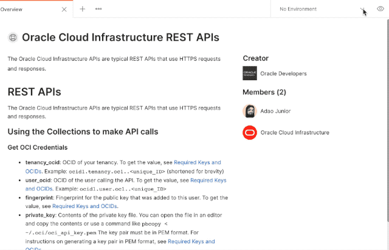

# Oracle Cloud Infrastructure REST APIs

Here you will find Information to use Oracle Cloud Infrastructure REST APIs with Postman

The Oracle Cloud Infrastructure APIs are typical REST APIs that use HTTPS requests and responses.

## Using the Collections to make API calls

### Run the Collection APIs on Postman

[](https://app.getpostman.com/run-collection/29850-f17fbdb8-f1f1-4bb2-b291-bbd28d5d1642?action=collection%2Ffork&collection-url=entityId%3D29850-f17fbdb8-f1f1-4bb2-b291-bbd28d5d1642%26entityType%3Dcollection%26workspaceId%3D0b1b0dd5-9d42-4066-b60f-757a0a7c3a69#?env%5BOCI%20Credentials%5D=W3sia2V5IjoidGVuYW5jeV9vY2lkIiwidmFsdWUiOiIiLCJlbmFibGVkIjp0cnVlfSx7ImtleSI6InVzZXJfb2NpZCIsInZhbHVlIjoiIiwiZW5hYmxlZCI6dHJ1ZX0seyJrZXkiOiJmaW5nZXJwcmludCIsInZhbHVlIjoiIiwiZW5hYmxlZCI6dHJ1ZX0seyJrZXkiOiJwcml2YXRlX2tleSIsInZhbHVlIjoiIiwiZW5hYmxlZCI6dHJ1ZX0seyJrZXkiOiJwYXNzcGhyYXNlIiwidmFsdWUiOiIiLCJlbmFibGVkIjp0cnVlfSx7ImtleSI6InJlZ2lvbiIsInZhbHVlIjoidXMtYXNoYnVybi0xIiwiZW5hYmxlZCI6dHJ1ZX0seyJrZXkiOiJjb21wYXJ0bWVudF9vY2lkIiwidmFsdWUiOiJvY2lkMS5jb21wYXJ0bWVudC4uLiIsImVuYWJsZWQiOnRydWV9XQ==)

### Visit the Oracle Developer team on [Postman.com/oracledevs](https://www.postman.com/oracledevs)

### Get OCI Credentials

| Entry            | Description and Where to Get the Value                                                                                                                                                                                                                                                                                                                                                         | Required?                                                                                         |
|------------------|------------------------------------------------------------------------------------------------------------------------------------------------------------------------------------------------------------------------------------------------------------------------------------------------------------------------------------------------------------------------------------------------|---------------------------------------------------------------------------------------------------|
| tenancy_ocid     | OCID of your tenancy. To get the value, see [Required Keys and OCIDs](https://docs.oracle.com/en-us/iaas/Content/API/Concepts/apisigningkey.htm#Required_Keys_and_OCIDs).<br><br>Example: `ocid1.tenancy.oc1..<unique_ID>`                                                                                                                                                              | Yes                                                                                               |
| user_ocid        | OCID of the user calling the API. To get the value, see [Required Keys and OCIDs](https://docs.oracle.com/en-us/iaas/Content/API/Concepts/apisigningkey.htm#Required_Keys_and_OCIDs).<br><br>Example: `ocid1.user.oc1..<unique_ID>` (shortened for brevity)                                                                                                                            | Yes                                                                                               |
| fingerprint      | Fingerprint for the public key that was added to this user. To get the value, see [Required Keys and OCIDs](https://docs.oracle.com/en-us/iaas/Content/API/Concepts/apisigningkey.htm#Required_Keys_and_OCIDs).                                                                                                                                                                         | Yes                                                                                               |
| private_key      | Contents of the private key file. You can open the file in an editor or use a command like `pbcopy < ~/.oci/oci_api_key.pem`<br><br>**Important**: The key pair must be in PEM format. For instructions on generating a key pair in PEM format, see [Required Keys and OCIDs](https://docs.oracle.com/en-us/iaas/Content/API/Concepts/apisigningkey.htm#Required_Keys_and_OCIDs). | Yes                                                                                               |
| passphrase       | Passphrase used for the key, if it is encrypted.                                                                                                                                                                                                                                                                                                                                               | if key is encrypted and passphrase has not been configured to be passed to at runtime |
| region           | An Oracle Cloud Infrastructure region. See [Regions and Availability Domains](https://docs.oracle.com/en-us/iaas/Content/General/Concepts/regions.htm#top).<br><br>Example: `us-ashburn-1`                                                                                                                                                                                                     | Yes                                                                                               |
| compartment_ocid | OCID of the compartment that will be used for the API calls.                                                                                                                                                                                                                                                                                                                                   | No                                                                                                |

### Select and Update OCI Credentials Variable

Update the `OCI Credentials` Postman Enviroment Variables with your Oracle Cloud Infrastructure credentials information.



## API Reference and Endpoints

For links to the Oracle Cloud Infrastructure API reference and a list of the regional API endpoints, see [API Reference and Endpoints](https://docs.oracle.com/iaas/api/).

## API Version

The base path of the endpoint includes the desired API version (for example, 20160918). Here's an example for a POST request to create a new VCN in the Ashburn region:

```bash
POST https://iaas.us-ashburn-1.oraclecloud.com/20160918/vcns
```

## API Breaking Changes Policy

Oracle Cloud Infrastructure will provide 12 months advance notice prior to the date of removing or changing an existing API of a Cloud Service that you have deployed which would require you to update your code.

## Maximum Allowed Client Clock Skew

HTTP status code 401 (NotAuthenticated) is returned if the client's clock is skewed more than 5 minutes from the server's. 

## Request and Response Format

The Oracle Cloud Infrastructure APIs use standard HTTP requests and responses. Each may contain Oracle-specific headers for pagination, entity tags (ETags), and so on as described elsewhere in this topic and in the API documentation.

Each response includes a unique Oracle-assigned request ID (for example, bb3f3275-f356-462a-93c4-bf40fb82bb02) in the `opc-request-id` response header. If you need to contact Oracle about a particular request, please provide this request ID.

Many of the API operations require JSON in the request body or return JSON in the response body. The specific contents of the JSON are described in the API documentation for the individual operation. Notice that the JSON is not wrapped or labeled according to the operation's name or the object's name or type.

> Note: Make sure to set the Content-Type header to application/json in your POST and PUT requests that contain JSON in the body.
